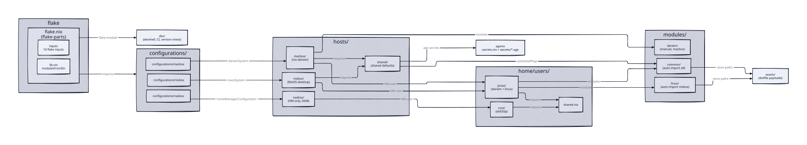

______________________________________________________________________

title: Architecture Overview
generated_commit: b9ee706915c5dfd42b98ba9de6c553e1df8a2c8d
source_paths:

- flake.nix
- lib.nix

______________________________________________________________________

# nix-config Architecture

Flake-managed declarative Nix configuration for three hosts: nixbox (NixOS desktop),
nasbox (Synology NAS, Home Manager only), and macbox (nix-darwin laptop). Built with
flake-parts: `flake.nix` declares inputs and imports per-host
`configurations/<host>/flake-module.nix` modules plus `dev/flake-module.nix`. One
`nixpkgs` (nixos-unstable) input is followed by home-manager, nix-darwin, agenix,
dev-flake, nix-index-database, and the pyproject/uv2nix inputs; disko, nixvim, and
nix-homebrew pin their own. Shared Home Manager modules live in `modules/common/`
(auto-imported everywhere, exported as `flake.homeModules`), Linux-only ones in
`modules/linux/` (auto-imported on nixbox), and Darwin-only ones in `modules/darwin/`
(added by hand). Secrets are encrypted with agenix; raw dotfile payloads live in
`assets/`.

## Units

| Unit | Description |
| --- | --- |
| [flake-root](flake-root/index.md) | Flake entry point, inputs, flake-parts wiring, `lib.nix` helpers |
| [dev](dev/index.md) | Devshell, formatters, pre-commit hooks, CI, version-check, Renovate |
| [hosts](hosts/index.md) | Per-host system configuration plus shared defaults |
| [home](home/index.md) | Per-user Home Manager layers (jonas, root) |
| [modules-common](modules-common/index.md) | Home Manager modules shared by all hosts (nixvim, opencode, git, tmux, ...) |
| [modules-linux](modules-linux/index.md) | Linux-only Home Manager modules (sway, waybar, libvirt, ...) |
| [modules-darwin](modules-darwin/index.md) | Darwin-only Home Manager modules (aerospace) |
| [secrets](secrets/index.md) | agenix secret management and path plumbing |
| [assets](assets/index.md) | Raw dotfile payloads referenced by modules as store paths |
